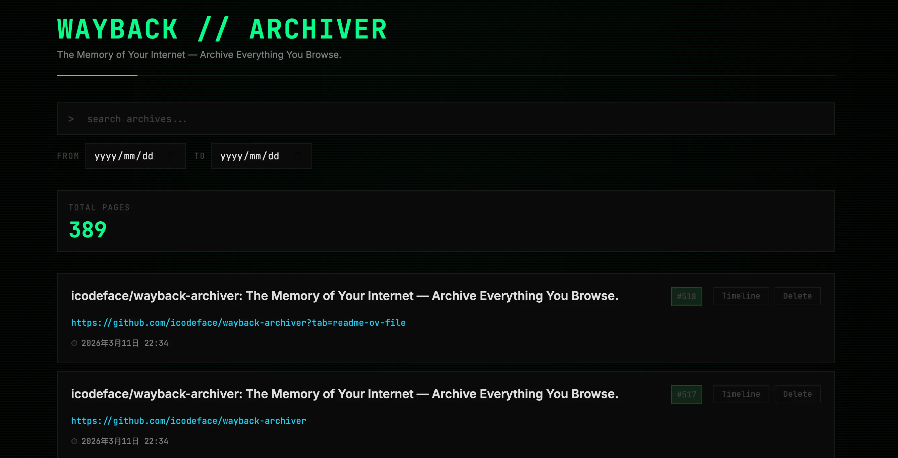
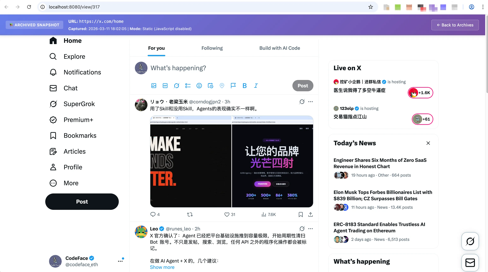
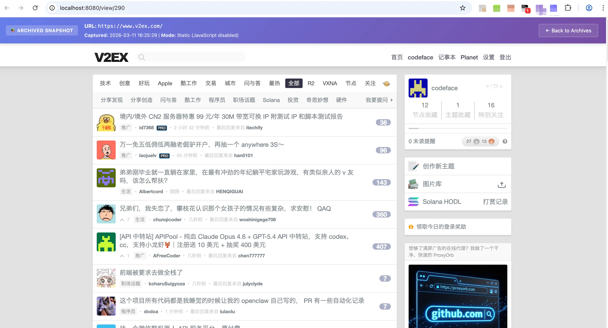

# Wayback Archiver

> *The Memory of Your Internet — Archive Everything You Browse.*

English | [中文](README-zh.md)

A self-hosted personal web archiving system that automatically captures and preserves web pages you visit in Chrome — HTML, CSS, JavaScript, images, and all. When the original page goes offline, you can still browse your archived copy with styles and layout intact.

  
   
  

## How It Works

```
Chrome + Tampermonkey ──HTTP POST──▶ Go Server ──▶ PostgreSQL (metadata)
  (auto-capture on                    │               + File System (assets)
   page load)                         │
                                      ▼
                                   Web UI ──▶ Browse / Search / Replay
```

1. A Tampermonkey userscript runs in your browser, automatically capturing the full DOM and resources once the page finishes loading. If significant DOM changes occur afterward, it submits one additional update.
2. The Go server receives the snapshot, downloads any cross-origin resources the browser couldn't fetch, deduplicates everything by content hash, and stores it locally.
3. A built-in Web UI lets you list, search, and replay any archived page — fully offline, no external dependencies.

## Features

- **High-fidelity replay** — CSSOM serialization, computed styles inlining, and anti-refresh protection reproduce pages as close to the original as possible
- **Full-page capture** — HTML, CSS, JS, images, fonts; resource URLs are rewritten to local paths
- **Cross-origin resource recovery** — server-side extraction and download of resources blocked by CORS
- **Content-hash deduplication** — identical resources shared across pages are stored only once (SHA-256)
- **Version history** — same URL archived multiple times, distinguished by timestamp
- **Timeline view** — browse all snapshots of a URL on a visual timeline (like web.archive.org), with prev/next navigation between snapshots
- **Smart dedup** — session-level + server-level dedup prevents redundant captures; content-hash comparison skips unchanged pages
- **Dynamic content support** — captures the live DOM state; MutationObserver triggers one auto-update if significant changes occur after initial capture
- **SPA-aware** — detects SPA navigation, resets capture state per route
- **Anti-refresh protection** — archived pages are frozen: timers, WebSockets, and navigation APIs are neutralized
- **Web UI** — responsive interface to browse, full-text search (page content, URL, and title), filter by date range, and replay archived pages
- **RESTful API** — programmatic access to all archiving and query operations

## Prerequisites

- **Go** 1.21+
- **Node.js** 16+ (for building the userscript)
- **PostgreSQL** 14+
- **Chrome** + [Tampermonkey](https://www.tampermonkey.net/) extension

## Quick Start

### 1. Database Setup

```bash
createdb -U postgres wayback
psql -U postgres wayback < server/init_db.sql
```

### 2. Start the Server

```bash
cd server
cp .env.example .env   # edit as needed
go build -o wayback-server ./cmd/server
./wayback-server
```

The server starts at `http://localhost:8080` by default.

If you need a proxy for downloading external resources:

```bash
export http_proxy=http://127.0.0.1:7897
export https_proxy=http://127.0.0.1:7897
./wayback-server
```

### 3. Install the Userscript

```bash
cd browser
npm install
npm run build
```

Then:

1. Open Tampermonkey dashboard in Chrome
2. Create a new script
3. Paste the contents of `browser/dist/wayback.user.js`
4. Save and enable

### 4. Start Browsing

That's it. Pages are automatically archived as soon as they load. Open `http://localhost:8080` to browse your archive.

## Configuration

Environment variables (or `.env` file in `server/`):

| Variable | Default | Description |
|---|---|---|
| `DB_HOST` | `localhost` | PostgreSQL host |
| `DB_PORT` | `5432` | PostgreSQL port |
| `DB_USER` | `postgres` | Database user |
| `DB_PASSWORD` | *(empty)* | Database password |
| `DB_NAME` | `wayback` | Database name |
| `DB_SSLMODE` | `disable` | SSL mode |
| `SERVER_PORT` | `8080` | HTTP server port |
| `DATA_DIR` | `./data` | Storage directory for HTML and resources |
| `LOG_DIR` | `./data/logs` | Log file directory |
| `AUTH_PASSWORD` | *(empty)* | HTTP Basic Auth password (disabled when empty, username: `wayback`) |

## API

| Method | Endpoint | Description |
|---|---|---|
| `POST` | `/api/archive` | Create a page archive |
| `PUT` | `/api/archive/:id` | Update an existing archive snapshot |
| `GET` | `/api/pages` | List all archived pages |
| `GET` | `/api/pages/:id` | Get page details |
| `GET` | `/api/search?q=keyword` | Search pages by URL or title |
| `GET` | `/api/pages/timeline?url=URL` | Get all snapshots of a URL (timeline view) |
| `GET` | `/api/logs` | List available log files |
| `GET` | `/api/logs/:filename` | Get log file content (supports `?tail=N`) |
| `GET` | `/view/:id` | Replay an archived page |
| `GET` | `/timeline?url=URL` | Visual timeline page for a URL |
| `GET` | `/logs` | Server logs viewer |

### POST /api/archive

Returns `{ status, page_id, action }` where `action` is `created` or `unchanged` (content identical, only `last_visited` updated).

### PUT /api/archive/:id

Accepts the same body as POST. Replaces the snapshot content — old HTML and resource associations are removed, resources are re-processed. Returns `{ status, page_id, action }` where `action` is `updated` or `unchanged`.

## Project Structure

```
wayback-archiver/
├── browser/                  # Tampermonkey userscript (TypeScript)
│   ├── src/
│   │   ├── main.ts           # Entry point & orchestration
│   │   ├── config.ts         # Constants
│   │   ├── types.ts          # TypeScript interfaces
│   │   ├── page-filter.ts    # URL filtering logic
│   │   ├── page-freezer.ts   # Freeze page runtime state
│   │   ├── dom-collector.ts  # DOM serialization
│   │   └── archiver.ts       # Server communication
│   ├── dist/                 # Built userscript
│   └── build.js              # Bundle script
│
├── server/                   # Go backend
│   ├── cmd/server/main.go    # Entry point
│   ├── internal/
│   │   ├── api/              # HTTP handlers (modular)
│   │   ├── config/           # Environment-based config
│   │   ├── database/         # PostgreSQL operations
│   │   ├── logging/          # File-based logging with rotation
│   │   ├── models/           # Data models
│   │   └── storage/          # File storage & dedup
│   ├── web/                  # Web UI static files
│   └── .env.example
│
└── tests/                    # Test suites
    ├── browser/              # Browser-side tests
    └── server/               # Server-side & E2E tests
```

## Storage Layout

```
data/
├── html/                     # HTML snapshots, organized by date
│   └── 2026/03/09/
│       └── <timestamp>_<hash>.html
├── logs/                     # Server logs, rotated by size (10MB) and date (7-day retention)
│   ├── wayback-2026-03-12.001.log
│   └── wayback-2026-03-12.002.log
└── resources/                # Deduplicated static resources
    └── ab/cd/
        └── <sha256>.css
```

## Testing

```bash
# Go unit tests
cd server && go test ./... -v

# E2E tests (requires Chrome)
cd tests/server && node test_update_feature.js
```

## Known Limitations

- Some cross-origin resources may still fail due to server-side 403/404 responses
- Dynamically injected scripts (loaded via JS at runtime) may not be captured
- Tracking pixels and analytics URLs with dynamic parameters are not preserved (they don't affect page rendering)
- Very large media files (video, large images) will consume significant storage

## License

MIT
